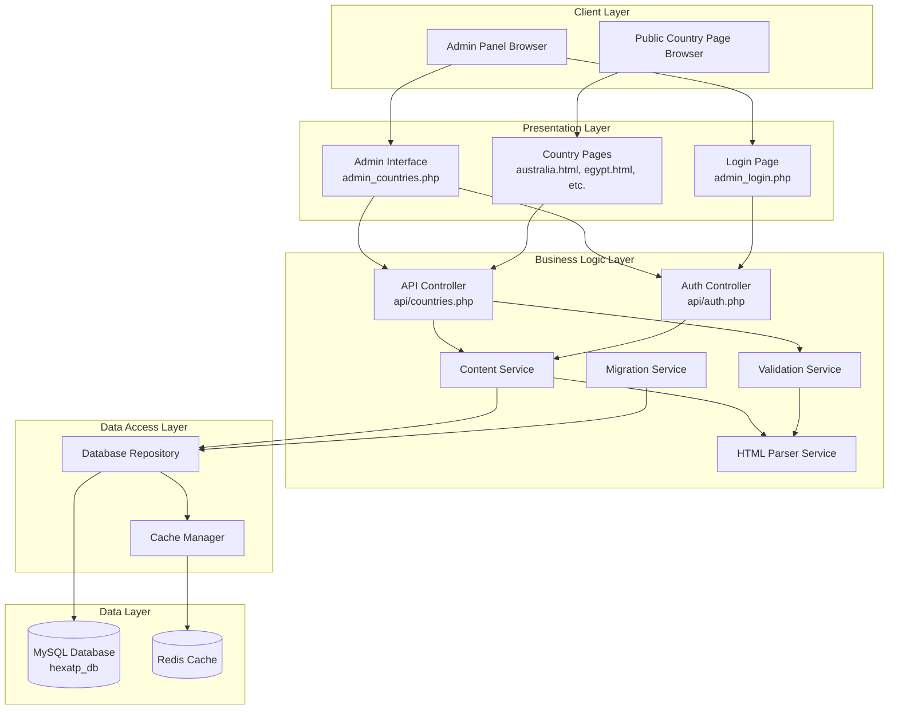
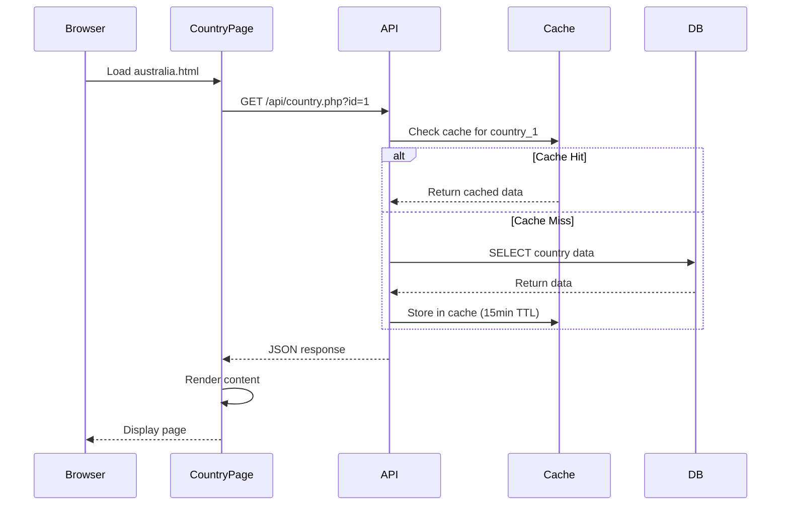
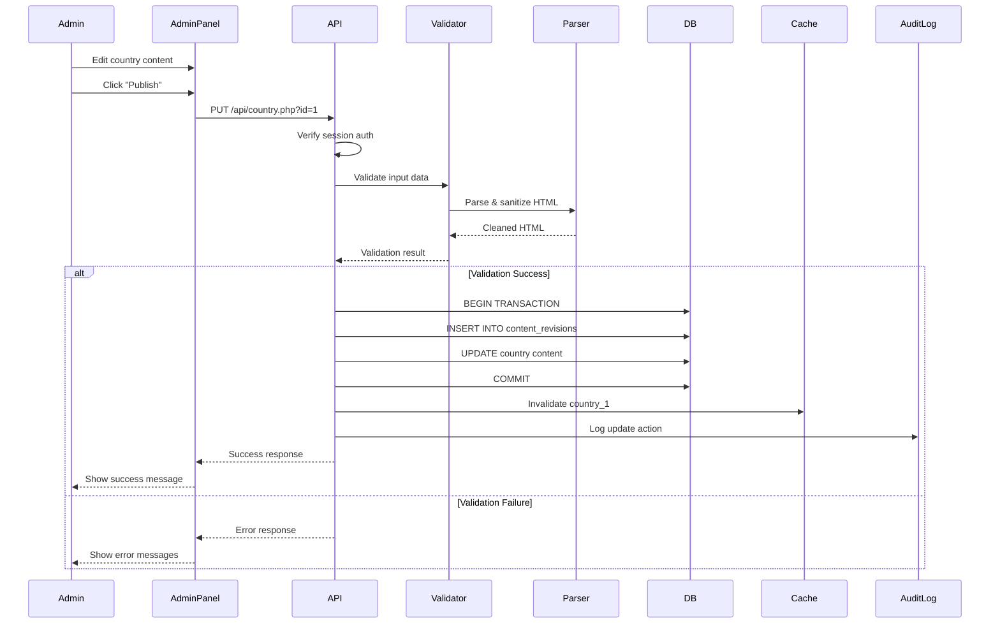
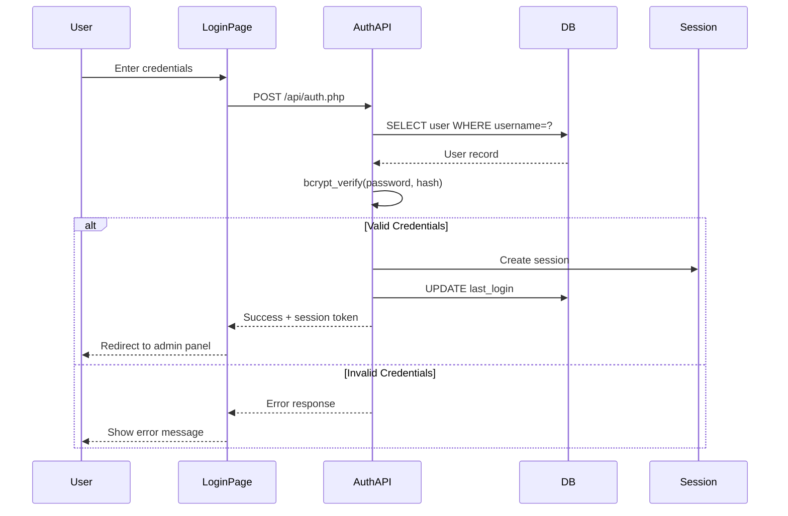
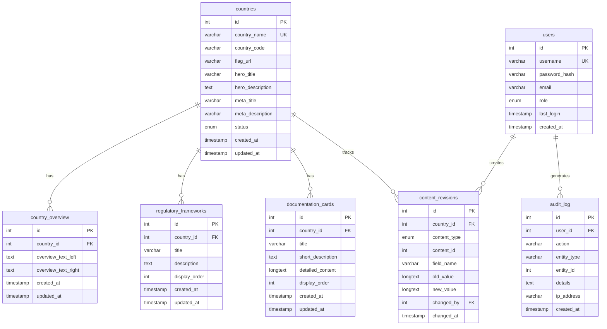

# Design Document: Country Content Management System

## Overview

The Country Content Management System (CMS) transforms the HexaTP website from static HTML country pages to a dynamic, database-driven content management platform. This system enables non-technical administrators to manage transfer pricing law content for multiple countries through a web-based interface without touching code.

### System Goals

- **Content Centralization**: Move all country-specific content from hardcoded HTML files into a structured MySQL database
- **User Empowerment**: Provide a WYSIWYG editing interface for non-technical content administrators
- **Consistency**: Maintain existing page design, styling, and user experience while enabling dynamic content
- **Performance**: Ensure fast page loads through caching and optimized database queries
- **Security**: Implement robust authentication, authorization, and input validation
- **Scalability**: Support easy addition of new countries and content types

### Technology Stack

- **Backend**: PHP 7.4+ with MySQLi
- **Database**: MySQL 8.0+ (existing hexatp_db database)
- **Frontend**: HTML5, CSS3, JavaScript (ES6+), Bootstrap 5.3.2
- **WYSIWYG Editor**: TinyMCE or CKEditor
- **Caching**: Redis or Memcached (server-side), Browser Cache API (client-side)
- **Authentication**: PHP Sessions with bcrypt password hashing

### Architecture Style

- **Monolithic Architecture**: Single PHP application with clear separation of concerns
- **Three-Tier Architecture**: Presentation Layer (HTML/JS), Business Logic Layer (PHP), Data Layer (MySQL)
- **RESTful API**: JSON-based API endpoints for CRUD operations
- **Progressive Enhancement**: Core functionality works without JavaScript, enhanced with AJAX


## Architecture

### System Architecture Diagram



### Component Responsibilities

#### Presentation Layer
- **Admin Interface**: Provides forms, tables, and WYSIWYG editors for content management
- **Country Pages**: Dynamically loads and displays country content from the database
- **Login Page**: Handles user authentication UI

#### Business Logic Layer
- **API Controller**: Routes HTTP requests to appropriate services, handles response formatting
- **Auth Controller**: Manages authentication, session creation, and authorization checks
- **Content Service**: Implements business logic for CRUD operations on country content
- **Validation Service**: Validates input data, checks business rules, sanitizes HTML
- **HTML Parser Service**: Parses, validates, and formats HTML content from WYSIWYG editor
- **Migration Service**: Extracts content from static HTML files and populates database

#### Data Access Layer
- **Database Repository**: Executes SQL queries using prepared statements, maps results to objects
- **Cache Manager**: Handles cache reads/writes, invalidation, and TTL management

#### Data Layer
- **MySQL Database**: Stores all country content, user accounts, audit logs, and revisions
- **Redis Cache**: Stores frequently accessed content with 15-minute TTL

### Data Flow Diagrams

#### Content Retrieval Flow (Public Page)



#### Content Update Flow (Admin Panel)



### Security Architecture

#### Authentication Flow



#### Authorization Layers

1. **Session Validation**: Every admin page checks for valid session
2. **CSRF Protection**: All forms include CSRF tokens validated on submission
3. **Role-Based Access Control (RBAC)**: 
   - `admin` role: Full access (create, read, update, delete)
   - `editor` role: Limited access (read, update existing content only)
4. **API Authentication**: All POST/PUT/DELETE requests verify session before processing
5. **Input Sanitization**: All user input sanitized before database storage
6. **SQL Injection Prevention**: Prepared statements for all database queries


## Components and Interfaces

### Database Schema

#### Entity-Relationship Diagram



#### Table Definitions

**countries**
```sql
CREATE TABLE countries (
    id INT AUTO_INCREMENT PRIMARY KEY,
    country_name VARCHAR(100) NOT NULL UNIQUE,
    country_code VARCHAR(10) NOT NULL,
    flag_url VARCHAR(255),
    hero_title VARCHAR(255),
    hero_description TEXT,
    meta_title VARCHAR(255),
    meta_description VARCHAR(500),
    status ENUM('draft', 'published') DEFAULT 'draft',
    created_at TIMESTAMP DEFAULT CURRENT_TIMESTAMP,
    updated_at TIMESTAMP DEFAULT CURRENT_TIMESTAMP ON UPDATE CURRENT_TIMESTAMP,
    INDEX idx_country_code (country_code),
    INDEX idx_status (status)
) ENGINE=InnoDB DEFAULT CHARSET=utf8mb4 COLLATE=utf8mb4_unicode_ci;
```

**country_overview**
```sql
CREATE TABLE country_overview (
    id INT AUTO_INCREMENT PRIMARY KEY,
    country_id INT NOT NULL,
    overview_text_left TEXT,
    overview_text_right TEXT,
    created_at TIMESTAMP DEFAULT CURRENT_TIMESTAMP,
    updated_at TIMESTAMP DEFAULT CURRENT_TIMESTAMP ON UPDATE CURRENT_TIMESTAMP,
    FOREIGN KEY (country_id) REFERENCES countries(id) ON DELETE CASCADE,
    INDEX idx_country_id (country_id)
) ENGINE=InnoDB DEFAULT CHARSET=utf8mb4 COLLATE=utf8mb4_unicode_ci;
```

**regulatory_frameworks**
```sql
CREATE TABLE regulatory_frameworks (
    id INT AUTO_INCREMENT PRIMARY KEY,
    country_id INT NOT NULL,
    title VARCHAR(255) NOT NULL,
    description TEXT,
    display_order INT NOT NULL DEFAULT 0,
    created_at TIMESTAMP DEFAULT CURRENT_TIMESTAMP,
    updated_at TIMESTAMP DEFAULT CURRENT_TIMESTAMP ON UPDATE CURRENT_TIMESTAMP,
    FOREIGN KEY (country_id) REFERENCES countries(id) ON DELETE CASCADE,
    INDEX idx_country_display (country_id, display_order)
) ENGINE=InnoDB DEFAULT CHARSET=utf8mb4 COLLATE=utf8mb4_unicode_ci;
```

**documentation_cards**
```sql
CREATE TABLE documentation_cards (
    id INT AUTO_INCREMENT PRIMARY KEY,
    country_id INT NOT NULL,
    title VARCHAR(255) NOT NULL,
    short_description TEXT,
    detailed_content LONGTEXT,
    display_order INT NOT NULL DEFAULT 0,
    created_at TIMESTAMP DEFAULT CURRENT_TIMESTAMP,
    updated_at TIMESTAMP DEFAULT CURRENT_TIMESTAMP ON UPDATE CURRENT_TIMESTAMP,
    FOREIGN KEY (country_id) REFERENCES countries(id) ON DELETE CASCADE,
    INDEX idx_country_display (country_id, display_order)
) ENGINE=InnoDB DEFAULT CHARSET=utf8mb4 COLLATE=utf8mb4_unicode_ci;
```

**content_revisions**
```sql
CREATE TABLE content_revisions (
    id INT AUTO_INCREMENT PRIMARY KEY,
    country_id INT NOT NULL,
    content_type ENUM('country', 'overview', 'regulatory_framework', 'documentation_card') NOT NULL,
    content_id INT NOT NULL,
    field_name VARCHAR(100) NOT NULL,
    old_value LONGTEXT,
    new_value LONGTEXT,
    changed_by INT NOT NULL,
    changed_at TIMESTAMP DEFAULT CURRENT_TIMESTAMP,
    FOREIGN KEY (country_id) REFERENCES countries(id) ON DELETE CASCADE,
    FOREIGN KEY (changed_by) REFERENCES users(id),
    INDEX idx_country_date (country_id, changed_at),
    INDEX idx_content (content_type, content_id)
) ENGINE=InnoDB DEFAULT CHARSET=utf8mb4 COLLATE=utf8mb4_unicode_ci;
```

**users**
```sql
CREATE TABLE users (
    id INT AUTO_INCREMENT PRIMARY KEY,
    username VARCHAR(50) NOT NULL UNIQUE,
    password_hash VARCHAR(255) NOT NULL,
    email VARCHAR(255) NOT NULL,
    role ENUM('admin', 'editor') DEFAULT 'editor',
    last_login TIMESTAMP NULL,
    created_at TIMESTAMP DEFAULT CURRENT_TIMESTAMP,
    INDEX idx_username (username)
) ENGINE=InnoDB DEFAULT CHARSET=utf8mb4 COLLATE=utf8mb4_unicode_ci;
```

**audit_log**
```sql
CREATE TABLE audit_log (
    id INT AUTO_INCREMENT PRIMARY KEY,
    user_id INT NOT NULL,
    action VARCHAR(50) NOT NULL,
    entity_type VARCHAR(50) NOT NULL,
    entity_id INT,
    details TEXT,
    ip_address VARCHAR(45),
    created_at TIMESTAMP DEFAULT CURRENT_TIMESTAMP,
    FOREIGN KEY (user_id) REFERENCES users(id),
    INDEX idx_user_date (user_id, created_at),
    INDEX idx_entity (entity_type, entity_id)
) ENGINE=InnoDB DEFAULT CHARSET=utf8mb4 COLLATE=utf8mb4_unicode_ci;
```

### API Endpoints

#### Countries API

**GET /api/countries.php**
- **Purpose**: Retrieve list of all countries
- **Authentication**: Optional (public endpoint)
- **Query Parameters**:
  - `status` (optional): Filter by status ('draft', 'published', 'all')
  - `sort` (optional): Sort field ('name', 'updated_at', 'created_at')
  - `order` (optional): Sort order ('ASC', 'DESC')
- **Response**: 200 OK
```json
{
  "success": true,
  "data": [
    {
      "id": 1,
      "country_name": "Australia",
      "country_code": "AU",
      "flag_url": "https://...",
      "status": "published",
      "updated_at": "2024-01-15 10:30:00"
    }
  ],
  "count": 15
}
```

**GET /api/country.php?id={country_id}**
- **Purpose**: Retrieve complete content for a specific country
- **Authentication**: Optional (public endpoint)
- **Path Parameters**: `id` (required): Country ID
- **Response**: 200 OK
```json
{
  "success": true,
  "data": {
    "country": {
      "id": 1,
      "country_name": "Australia",
      "country_code": "AU",
      "flag_url": "https://...",
      "hero_title": "Transfer Pricing Australia",
      "hero_description": "Master the Australian Taxation Office...",
      "meta_title": "Australia Transfer Pricing | HexaTP",
      "meta_description": "Comprehensive guide...",
      "status": "published"
    },
    "overview": {
      "overview_text_left": "<p>Australia has some of the most...</p>",
      "overview_text_right": "<p>The 2026 reporting landscape...</p>"
    },
    "regulatory_frameworks": [
      {
        "id": 1,
        "title": "Subdivision 815-B",
        "description": "The primary legislation...",
        "display_order": 1
      }
    ],
    "documentation_cards": [
      {
        "id": 1,
        "title": "Australian Local File (ALF)",
        "short_description": "Mandatory XML reporting...",
        "detailed_content": "<p>As of 2025, the ATO requires...</p>",
        "display_order": 1
      }
    ]
  }
}
```

**POST /api/country.php**
- **Purpose**: Create a new country
- **Authentication**: Required (admin role only)
- **Request Body**:
```json
{
  "country_name": "New Zealand",
  "country_code": "NZ",
  "flag_url": "https://...",
  "hero_title": "Transfer Pricing New Zealand",
  "hero_description": "Navigate NZ tax requirements...",
  "meta_title": "New Zealand Transfer Pricing",
  "meta_description": "Complete guide to NZ TP rules",
  "status": "draft"
}
```
- **Response**: 201 Created
```json
{
  "success": true,
  "message": "Country created successfully",
  "data": {
    "id": 16,
    "country_name": "New Zealand"
  }
}
```

**PUT /api/country.php?id={country_id}**
- **Purpose**: Update existing country content
- **Authentication**: Required (admin or editor role)
- **Request Body**: Same structure as POST, all fields optional
- **Response**: 200 OK
```json
{
  "success": true,
  "message": "Country updated successfully",
  "data": {
    "id": 1,
    "updated_at": "2024-01-15 11:45:00"
  }
}
```

**DELETE /api/country.php?id={country_id}**
- **Purpose**: Delete a country and all associated content
- **Authentication**: Required (admin role only)
- **Response**: 200 OK
```json
{
  "success": true,
  "message": "Country deleted successfully"
}
```

#### Authentication API

**POST /api/auth.php**
- **Purpose**: Authenticate user and create session
- **Action**: `login`
- **Request Body**:
```json
{
  "action": "login",
  "username": "admin",
  "password": "securepassword",
  "csrf_token": "abc123..."
}
```
- **Response**: 200 OK
```json
{
  "success": true,
  "message": "Login successful",
  "data": {
    "user_id": 1,
    "username": "admin",
    "role": "admin",
    "session_id": "xyz789..."
  }
}
```

**POST /api/auth.php**
- **Purpose**: Logout user and destroy session
- **Action**: `logout`
- **Request Body**:
```json
{
  "action": "logout"
}
```
- **Response**: 200 OK
```json
{
  "success": true,
  "message": "Logout successful"
}
```

#### Revisions API

**GET /api/revisions.php?country_id={country_id}**
- **Purpose**: Retrieve revision history for a country
- **Authentication**: Required
- **Query Parameters**:
  - `country_id` (required): Country ID
  - `limit` (optional): Number of revisions to return (default: 50)
  - `offset` (optional): Pagination offset
- **Response**: 200 OK
```json
{
  "success": true,
  "data": [
    {
      "id": 123,
      "content_type": "country",
      "field_name": "hero_title",
      "old_value": "Old Title",
      "new_value": "New Title",
      "changed_by": "admin",
      "changed_at": "2024-01-15 10:30:00"
    }
  ],
  "count": 45
}
```

**POST /api/revisions.php**
- **Purpose**: Restore a previous revision
- **Authentication**: Required (admin role only)
- **Request Body**:
```json
{
  "revision_id": 123,
  "csrf_token": "abc123..."
}
```
- **Response**: 200 OK
```json
{
  "success": true,
  "message": "Revision restored successfully"
}
```

### Frontend Components

#### Admin Panel Components

**CountryListTable**
- **Purpose**: Display all countries in a sortable, filterable table
- **Features**: 
  - Sort by name, status, last updated
  - Filter by status (all, draft, published)
  - Search by country name or code
  - Action buttons (Edit, View, Delete)
- **Dependencies**: Bootstrap 5 DataTables

**CountryEditForm**
- **Purpose**: Comprehensive form for editing all country content
- **Sections**:
  - Hero Section (title, description, flag URL)
  - SEO Meta Tags (meta title, meta description)
  - Overview (left and right text columns with WYSIWYG)
  - Regulatory Frameworks (3 boxes with title/description)
  - Documentation Cards (dynamic list with add/remove/reorder)
- **Features**:
  - Auto-save drafts every 2 minutes
  - Preview button (opens modal with rendered content)
  - Publish/Save Draft buttons
  - Character counters for limited fields
  - Validation error highlighting
- **Dependencies**: TinyMCE, SortableJS (for drag-drop reordering)

**RevisionHistoryModal**
- **Purpose**: Display and compare content revisions
- **Features**:
  - Timeline view of all changes
  - Side-by-side diff view
  - Restore button for each revision
  - Filter by content type and date range
- **Dependencies**: diff-match-patch library

**BulkOperationsPanel**
- **Purpose**: Perform actions on multiple countries
- **Features**:
  - Checkbox selection
  - Bulk status change (draft/published)
  - Bulk export to JSON
  - Bulk delete with confirmation
- **Dependencies**: None

#### Public Page Components

**DynamicContentLoader**
- **Purpose**: Fetch and render country content on public pages
- **Features**:
  - Loading spinner during fetch
  - Error handling with fallback content
  - Browser caching (1 hour)
  - Lazy loading for documentation card details
- **Implementation**: Vanilla JavaScript (no framework dependencies)

**ExpandableDocumentationCard**
- **Purpose**: Render collapsible documentation cards
- **Features**:
  - Smooth expand/collapse animation
  - Lazy load detailed content on first expand
  - Maintain state in URL hash for deep linking
- **Implementation**: Vanilla JavaScript with CSS transitions


## Data Models

### PHP Class Structures

#### Country Model
```php
class Country {
    public int $id;
    public string $country_name;
    public string $country_code;
    public ?string $flag_url;
    public ?string $hero_title;
    public ?string $hero_description;
    public ?string $meta_title;
    public ?string $meta_description;
    public string $status; // 'draft' or 'published'
    public DateTime $created_at;
    public DateTime $updated_at;
    
    // Relationships
    public ?CountryOverview $overview;
    public array $regulatory_frameworks; // RegulatoryFramework[]
    public array $documentation_cards; // DocumentationCard[]
    
    public function validate(): ValidationResult;
    public function toArray(): array;
    public static function fromArray(array $data): Country;
}
```

#### CountryOverview Model
```php
class CountryOverview {
    public int $id;
    public int $country_id;
    public ?string $overview_text_left;
    public ?string $overview_text_right;
    public DateTime $created_at;
    public DateTime $updated_at;
    
    public function validate(): ValidationResult;
    public function toArray(): array;
}
```

#### RegulatoryFramework Model
```php
class RegulatoryFramework {
    public int $id;
    public int $country_id;
    public string $title;
    public ?string $description;
    public int $display_order;
    public DateTime $created_at;
    public DateTime $updated_at;
    
    public function validate(): ValidationResult;
    public function toArray(): array;
}
```

#### DocumentationCard Model
```php
class DocumentationCard {
    public int $id;
    public int $country_id;
    public string $title;
    public ?string $short_description;
    public ?string $detailed_content;
    public int $display_order;
    public DateTime $created_at;
    public DateTime $updated_at;
    
    public function validate(): ValidationResult;
    public function toArray(): array;
}
```

#### ContentRevision Model
```php
class ContentRevision {
    public int $id;
    public int $country_id;
    public string $content_type; // 'country', 'overview', etc.
    public int $content_id;
    public string $field_name;
    public ?string $old_value;
    public ?string $new_value;
    public int $changed_by;
    public DateTime $changed_at;
    
    public function toArray(): array;
    public function getDiff(): string; // Returns HTML diff
}
```

#### User Model
```php
class User {
    public int $id;
    public string $username;
    private string $password_hash;
    public string $email;
    public string $role; // 'admin' or 'editor'
    public ?DateTime $last_login;
    public DateTime $created_at;
    
    public function verifyPassword(string $password): bool;
    public function setPassword(string $password): void;
    public function hasPermission(string $action, string $resource): bool;
    public function toArray(): array;
}
```

#### ValidationResult Model
```php
class ValidationResult {
    public bool $is_valid;
    public array $errors; // ['field_name' => 'error message']
    public array $warnings; // ['field_name' => 'warning message']
    
    public function addError(string $field, string $message): void;
    public function addWarning(string $field, string $message): void;
    public function hasErrors(): bool;
    public function getErrorMessages(): array;
}
```

### Service Layer Interfaces

#### ContentService
```php
interface ContentServiceInterface {
    public function getCountry(int $id): ?Country;
    public function getAllCountries(array $filters = []): array;
    public function createCountry(Country $country): int;
    public function updateCountry(int $id, Country $country): bool;
    public function deleteCountry(int $id): bool;
    public function publishCountry(int $id): bool;
    public function duplicateCountry(int $id, string $new_name): int;
}
```

#### ValidationService
```php
interface ValidationServiceInterface {
    public function validateCountry(Country $country): ValidationResult;
    public function validateOverview(CountryOverview $overview): ValidationResult;
    public function validateRegulatoryFramework(RegulatoryFramework $framework): ValidationResult;
    public function validateDocumentationCard(DocumentationCard $card): ValidationResult;
    public function checkBrokenLinks(string $html): array;
}
```

#### HTMLParserService
```php
interface HTMLParserServiceInterface {
    public function parse(string $html): ParsedHTML;
    public function sanitize(string $html): string;
    public function prettyPrint(ParsedHTML $parsed): string;
    public function validate(string $html): ValidationResult;
    public function extractText(string $html): string;
}
```

#### CacheService
```php
interface CacheServiceInterface {
    public function get(string $key): ?string;
    public function set(string $key, string $value, int $ttl = 900): bool;
    public function delete(string $key): bool;
    public function invalidateCountry(int $country_id): bool;
    public function clear(): bool;
}
```

### Data Transfer Objects (DTOs)

#### CountryDTO
```php
class CountryDTO {
    public ?int $id;
    public string $country_name;
    public string $country_code;
    public ?string $flag_url;
    public ?string $hero_title;
    public ?string $hero_description;
    public ?string $meta_title;
    public ?string $meta_description;
    public string $status;
    public ?array $overview;
    public ?array $regulatory_frameworks;
    public ?array $documentation_cards;
    
    public static function fromRequest(array $request): CountryDTO;
    public function toModel(): Country;
}
```

### HTML Parser Data Structures

#### ParsedHTML
```php
class ParsedHTML {
    public string $raw_html;
    public DOMDocument $dom;
    public array $allowed_tags;
    public array $errors;
    
    public function __construct(string $html);
    public function getBody(): string;
    public function removeDisallowedTags(): void;
    public function normalizeWhitespace(): void;
    public function escapeSpecialChars(): void;
    public function isValid(): bool;
}
```

#### HTMLNode
```php
class HTMLNode {
    public string $tag_name;
    public array $attributes;
    public array $children; // HTMLNode[]
    public ?string $text_content;
    public int $depth;
    
    public function toHTML(): string;
    public function hasChildren(): bool;
    public function getAttribute(string $name): ?string;
}
```


## Correctness Properties

*A property is a characteristic or behavior that should hold true across all valid executions of a system—essentially, a formal statement about what the system should do. Properties serve as the bridge between human-readable specifications and machine-verifiable correctness guarantees.*

### Property-Based Testing Applicability

This feature is a full-stack web application with multiple components. Most components (database CRUD, UI rendering, authentication, content migration) are **NOT suitable for property-based testing** and will be tested using:
- **Unit tests** for specific examples and edge cases
- **Integration tests** for database operations and API endpoints
- **End-to-end tests** for user workflows
- **Manual testing** for UI/UX validation

However, the **HTML Parser** component (Requirement 13) **IS highly suitable for property-based testing** because:
- It's a pure function with clear input/output behavior
- It has universal properties that should hold across all inputs (round-trip, sanitization, validation)
- The input space is large (infinite HTML strings)
- Parsers are a classic use case for PBT

Therefore, correctness properties are defined **only for the HTML Parser component**.

### Property 1: Valid HTML Parsing Success

*For any* valid HTML string conforming to the allowed tag set (p, strong, em, ul, ol, li, a, h1-h6, br), the parser SHALL successfully parse it into a structured ParsedHTML object without errors.

**Validates: Requirements 13.1**

**Test Strategy**: Generate random valid HTML structures with allowed tags, varying nesting depths (1-10 levels), and different content. Verify that `parse(html)` returns a ParsedHTML object with `isValid() == true` and `errors == []`.

### Property 2: Invalid HTML Error Reporting

*For any* invalid HTML string (unclosed tags, malformed attributes, disallowed nesting), the parser SHALL return a ValidationResult with descriptive error messages indicating the specific syntax issues.

**Validates: Requirements 13.2, 13.7**

**Test Strategy**: Generate random invalid HTML with known defects (unclosed tags, mismatched tags, invalid attributes). Verify that `parse(html)` returns a ParsedHTML object with `isValid() == false` and `errors` array contains descriptive messages referencing the defects.

### Property 3: Round-Trip Preservation (CRITICAL)

*For any* valid HTML content object, parsing then pretty-printing then parsing SHALL produce a structurally equivalent object. That is: `parse(prettyPrint(parse(html))) ≡ parse(html)`.

**Validates: Requirements 13.4, 13.3, 13.9**

**Test Strategy**: Generate random valid HTML with varying structures, whitespace, and special characters. Parse to get ParsedHTML object P1, pretty-print to get string S, parse S to get ParsedHTML object P2. Verify that P1 and P2 are structurally equivalent (same DOM tree, same text content, same attributes). This property subsumes pretty-printing consistency and special character escaping.

**Note**: This is the most important property for parser correctness. If this holds, it guarantees that the parser and pretty-printer are inverse operations, which is the fundamental requirement for a serialization system.

### Property 4: Tag Filtering and Sanitization

*For any* HTML string (valid or invalid), after parsing and sanitization, the resulting HTML SHALL contain only allowed tags (p, strong, em, ul, ol, li, a, h1-h6, br) and SHALL NOT contain any dangerous tags (script, iframe, object, embed, form, input).

**Validates: Requirements 13.5, 13.6**

**Test Strategy**: Generate random HTML containing a mix of allowed tags, disallowed-but-safe tags (div, span, table), and dangerous tags (script, iframe, object). Parse and sanitize. Verify that the output HTML contains only allowed tags and zero dangerous tags. Use regex or DOM inspection to verify tag presence.

### Property 5: Whitespace Normalization with Preservation

*For any* HTML string with excessive whitespace (multiple spaces, tabs, newlines), the parser SHALL normalize consecutive whitespace to single spaces WHILE preserving intentional line breaks (`<br>` tags) and paragraph boundaries (`<p>` tags).

**Validates: Requirements 13.8**

**Test Strategy**: Generate random HTML with excessive whitespace between words, around tags, and within text content. Parse and pretty-print. Verify that:
- Multiple consecutive spaces are reduced to single spaces
- Whitespace around tags is normalized
- `<br>` tags are preserved
- `<p>` tag boundaries create visual separation
- Text content readability is maintained

### Property 6: Deep Nesting Performance

*For any* valid HTML structure with nesting depth between 1 and 10 levels, the parser SHALL complete parsing within 100 milliseconds without stack overflow or performance degradation.

**Validates: Requirements 13.10**

**Test Strategy**: Generate random HTML with controlled nesting depths from 1 to 10 levels (e.g., nested `<ul><li><ul><li>...` structures). Measure parsing time for each depth. Verify that:
- All depths 1-10 parse successfully
- Parsing time remains under 100ms for all depths
- No stack overflow errors occur
- Time complexity is reasonable (e.g., linear or log-linear in depth)


## Error Handling

### Error Categories

#### Client-Side Errors (4xx)

**400 Bad Request**
- Invalid JSON in request body
- Missing required fields
- Invalid data types
- Validation failures (e.g., title too long, invalid email format)
- Response includes specific field errors

**401 Unauthorized**
- Missing or invalid session token
- Session expired (30 minutes inactivity)
- Response includes redirect to login page

**403 Forbidden**
- User lacks permission for requested action (e.g., editor trying to delete)
- CSRF token mismatch
- Response includes permission error message

**404 Not Found**
- Requested country ID doesn't exist
- Requested resource not found
- Response includes helpful message

**409 Conflict**
- Duplicate country name
- Concurrent edit conflict (optimistic locking)
- Response includes conflict details

#### Server-Side Errors (5xx)

**500 Internal Server Error**
- Database connection failure
- Unexpected exception in business logic
- File system errors
- Response includes generic error message (details logged server-side)

**503 Service Unavailable**
- Database maintenance mode
- Cache service unavailable
- Response includes retry-after header

### Error Response Format

All API errors follow consistent JSON structure:

```json
{
  "success": false,
  "error": {
    "code": "VALIDATION_ERROR",
    "message": "Validation failed for one or more fields",
    "details": {
      "hero_title": "Title must not exceed 100 characters",
      "overview_text_left": "Overview text is required"
    },
    "timestamp": "2024-01-15T10:30:00Z",
    "request_id": "abc123xyz"
  }
}
```

### Error Handling Strategies

#### Database Errors

**Connection Failures**
- Retry logic: 3 attempts with exponential backoff (1s, 2s, 4s)
- Fallback: Return cached data if available
- User message: "Service temporarily unavailable. Please try again."

**Query Failures**
- Log full error details (query, parameters, stack trace)
- Return generic error to user (don't expose SQL details)
- Alert monitoring system for investigation

**Transaction Failures**
- Automatic rollback on any error within transaction
- Log transaction details for debugging
- Return specific error to user (e.g., "Failed to save changes")

#### Validation Errors

**Field-Level Validation**
- Validate each field independently
- Collect all errors before returning response
- Highlight invalid fields in UI with specific messages
- Allow saving as draft even with validation warnings

**Business Rule Violations**
- Check business rules after field validation
- Examples: "All 3 regulatory frameworks required", "At least one overview paragraph required"
- Prevent publishing but allow draft saves

#### HTML Parser Errors

**Invalid HTML**
- Return descriptive error messages indicating line/column of syntax error
- Suggest corrections when possible
- Allow user to fix and resubmit

**Dangerous Content**
- Silently remove dangerous tags (script, iframe, object)
- Log security event with user ID and content
- Notify user that content was sanitized

**Malformed Structure**
- Attempt to auto-correct common issues (unclosed tags)
- If auto-correction fails, return error with details
- Provide "safe mode" that strips all HTML and keeps only text

#### Authentication Errors

**Invalid Credentials**
- Generic error message: "Invalid username or password"
- Don't reveal which field is incorrect (security)
- Rate limiting: Max 5 attempts per 15 minutes per IP
- Log failed attempts for security monitoring

**Session Expiration**
- Detect expired session on any API call
- Return 401 with redirect URL
- Preserve form data in browser localStorage for recovery
- Show friendly message: "Your session expired. Please log in again."

#### Cache Errors

**Cache Miss**
- Fallback to database query
- Log cache miss rate for monitoring
- No user-visible error

**Cache Service Unavailable**
- Bypass cache and query database directly
- Log cache service failure
- Alert operations team
- No user-visible error (graceful degradation)

### Logging Strategy

#### Log Levels

**ERROR**: System failures requiring immediate attention
- Database connection failures
- Unhandled exceptions
- Security violations (SQL injection attempts, XSS attempts)

**WARN**: Unexpected conditions that don't prevent operation
- Cache service unavailable
- Slow query performance (>1 second)
- Validation failures on publish attempts

**INFO**: Normal operational events
- User login/logout
- Content published
- Country created/updated/deleted

**DEBUG**: Detailed information for troubleshooting
- API request/response details
- Database query execution times
- Cache hit/miss statistics

#### Log Format

```
[2024-01-15 10:30:00] [ERROR] [user_id:5] [request_id:abc123] Database connection failed: Connection timeout after 5 seconds
[2024-01-15 10:30:05] [INFO] [user_id:5] Country updated: id=1, name=Australia
[2024-01-15 10:30:10] [WARN] [user_id:5] Slow query detected: 1.2s for SELECT * FROM documentation_cards WHERE country_id=1
```

#### Log Storage

- **Application Logs**: Stored in `/var/log/hexatp/app.log`, rotated daily, retained 30 days
- **Error Logs**: Stored in `/var/log/hexatp/error.log`, rotated daily, retained 90 days
- **Audit Logs**: Stored in database `audit_log` table, retained indefinitely
- **Security Logs**: Stored in `/var/log/hexatp/security.log`, rotated daily, retained 1 year

### User-Facing Error Messages

#### Friendly Error Messages

Replace technical errors with user-friendly messages:

| Technical Error | User Message |
|----------------|--------------|
| `mysqli_connect(): Connection refused` | "We're experiencing technical difficulties. Please try again in a few minutes." |
| `Duplicate entry 'Australia' for key 'country_name'` | "A country with this name already exists. Please choose a different name." |
| `SQLSTATE[HY000]: General error: 2006 MySQL server has gone away` | "Your session timed out. Please refresh the page and try again." |
| `Call to undefined function imagecreatefromjpeg()` | "Image upload failed. Please contact support." |

#### Error Recovery Guidance

Provide actionable guidance with errors:

```json
{
  "success": false,
  "error": {
    "message": "Failed to publish country",
    "details": {
      "regulatory_frameworks": "All 3 regulatory framework boxes must be filled"
    },
    "suggestions": [
      "Fill in all 3 regulatory framework boxes",
      "Or save as draft to continue editing later"
    ]
  }
}
```


## Testing Strategy

### Testing Approach Overview

The Country Content Management System requires a comprehensive testing strategy that combines multiple testing methodologies:

1. **Property-Based Testing**: For the HTML Parser component only
2. **Unit Testing**: For individual functions and classes
3. **Integration Testing**: For database operations and API endpoints
4. **End-to-End Testing**: For complete user workflows
5. **Manual Testing**: For UI/UX validation and visual regression

### Property-Based Testing (HTML Parser Only)

**Scope**: Only the HTML Parser component (Requirement 13) is suitable for property-based testing.

**Library**: PHPUnit with [Eris](https://github.com/giorgiosironi/eris) (PHP property-based testing library)

**Configuration**:
- Minimum 100 iterations per property test
- Each test tagged with feature name and property reference
- Tag format: `@group Feature: country-content-cms, Property {number}: {property_text}`

**Property Tests to Implement**:

1. **Property 1: Valid HTML Parsing Success**
   - Generator: Valid HTML with allowed tags, varying nesting (1-10 levels)
   - Assertion: `parse(html)->isValid() === true && parse(html)->errors === []`
   - Tag: `@group Feature: country-content-cms, Property 1: Valid HTML parsing success`

2. **Property 2: Invalid HTML Error Reporting**
   - Generator: Invalid HTML with known defects (unclosed tags, malformed attributes)
   - Assertion: `parse(html)->isValid() === false && count(parse(html)->errors) > 0`
   - Tag: `@group Feature: country-content-cms, Property 2: Invalid HTML error reporting`

3. **Property 3: Round-Trip Preservation**
   - Generator: Valid HTML with varying structures
   - Assertion: `parse(prettyPrint(parse(html))) ≡ parse(html)` (structural equivalence)
   - Tag: `@group Feature: country-content-cms, Property 3: Round-trip preservation`
   - **Note**: This is the most critical property

4. **Property 4: Tag Filtering and Sanitization**
   - Generator: HTML with mixed allowed, disallowed, and dangerous tags
   - Assertion: Output contains only allowed tags, zero dangerous tags
   - Tag: `@group Feature: country-content-cms, Property 4: Tag filtering and sanitization`

5. **Property 5: Whitespace Normalization**
   - Generator: HTML with excessive whitespace
   - Assertion: Output has normalized whitespace while preserving intentional breaks
   - Tag: `@group Feature: country-content-cms, Property 5: Whitespace normalization`

6. **Property 6: Deep Nesting Performance**
   - Generator: HTML with controlled nesting depths (1-10 levels)
   - Assertion: Parsing completes in <100ms for all depths
   - Tag: `@group Feature: country-content-cms, Property 6: Deep nesting performance`

**Example Property Test**:

```php
<?php
use Eris\Generator;
use PHPUnit\Framework\TestCase;

/**
 * @group Feature: country-content-cms, Property 3: Round-trip preservation
 */
class HTMLParserPropertyTest extends TestCase
{
    use Eris\TestTrait;
    
    public function testRoundTripPreservation()
    {
        $this->forAll(
            Generator\html(['p', 'strong', 'em', 'ul', 'ol', 'li', 'a', 'br'])
        )
        ->then(function ($html) {
            $parser = new HTMLParserService();
            
            // Parse original HTML
            $parsed1 = $parser->parse($html);
            $this->assertTrue($parsed1->isValid(), "Generated HTML should be valid");
            
            // Pretty print
            $prettyPrinted = $parser->prettyPrint($parsed1);
            
            // Parse again
            $parsed2 = $parser->parse($prettyPrinted);
            
            // Assert structural equivalence
            $this->assertHTMLEquivalent($parsed1, $parsed2);
        });
    }
    
    private function assertHTMLEquivalent(ParsedHTML $a, ParsedHTML $b): void
    {
        // Compare DOM trees for structural equivalence
        $this->assertEquals(
            $this->normalizeDOM($a->dom),
            $this->normalizeDOM($b->dom),
            "Parsed HTML structures should be equivalent after round-trip"
        );
    }
    
    private function normalizeDOM(DOMDocument $dom): string
    {
        // Normalize for comparison (remove whitespace differences, etc.)
        $dom->preserveWhiteSpace = false;
        $dom->formatOutput = false;
        return $dom->saveHTML();
    }
}
```

### Unit Testing

**Scope**: Individual functions, classes, and methods across all components

**Framework**: PHPUnit 9.x

**Coverage Target**: 80% code coverage minimum

**Test Categories**:

1. **Model Validation Tests**
   - Test `Country::validate()` with valid and invalid data
   - Test field length limits (hero_title ≤ 100 chars, etc.)
   - Test required field validation
   - Test data type validation

2. **Service Layer Tests**
   - Test `ContentService` CRUD operations with mocked database
   - Test `ValidationService` business rules
   - Test `CacheService` cache hit/miss scenarios
   - Test `AuthService` password hashing and verification

3. **Repository Tests**
   - Test SQL query construction
   - Test prepared statement parameter binding
   - Test result mapping to models
   - Use in-memory SQLite for fast tests

4. **Utility Function Tests**
   - Test date formatting functions
   - Test string sanitization functions
   - Test array manipulation helpers

**Example Unit Test**:

```php
<?php
class CountryValidationTest extends TestCase
{
    public function testHeroTitleLengthValidation()
    {
        $country = new Country();
        $country->hero_title = str_repeat('A', 101); // 101 characters
        
        $result = $country->validate();
        
        $this->assertFalse($result->is_valid);
        $this->assertArrayHasKey('hero_title', $result->errors);
        $this->assertStringContainsString('100 characters', $result->errors['hero_title']);
    }
    
    public function testRequiredFieldValidation()
    {
        $country = new Country();
        $country->country_name = ''; // Empty required field
        
        $result = $country->validate();
        
        $this->assertFalse($result->is_valid);
        $this->assertArrayHasKey('country_name', $result->errors);
    }
}
```

### Integration Testing

**Scope**: Database operations, API endpoints, external service interactions

**Framework**: PHPUnit with database fixtures

**Database Strategy**: Use test database `hexatp_db_test` with fixtures loaded before each test

**Test Categories**:

1. **Database Integration Tests**
   - Test actual SQL queries against test database
   - Test foreign key constraints
   - Test cascade deletes
   - Test transaction rollback on errors

2. **API Endpoint Tests**
   - Test GET /api/countries.php returns correct JSON
   - Test POST /api/country.php creates database record
   - Test PUT /api/country.php updates existing record
   - Test DELETE /api/country.php removes record and cascades
   - Test authentication and authorization on protected endpoints

3. **Cache Integration Tests**
   - Test cache population on first request
   - Test cache hit on subsequent requests
   - Test cache invalidation on updates
   - Test fallback to database when cache unavailable

**Example Integration Test**:

```php
<?php
class CountryAPIIntegrationTest extends TestCase
{
    protected function setUp(): void
    {
        // Load fixtures into test database
        $this->loadFixtures();
    }
    
    public function testGetCountryReturnsCompleteData()
    {
        $response = $this->apiRequest('GET', '/api/country.php?id=1');
        
        $this->assertEquals(200, $response->status);
        $this->assertTrue($response->json['success']);
        $this->assertArrayHasKey('country', $response->json['data']);
        $this->assertArrayHasKey('overview', $response->json['data']);
        $this->assertArrayHasKey('regulatory_frameworks', $response->json['data']);
        $this->assertCount(3, $response->json['data']['regulatory_frameworks']);
    }
    
    public function testUpdateCountryInvalidatesCache()
    {
        // First request populates cache
        $this->apiRequest('GET', '/api/country.php?id=1');
        $this->assertTrue($this->cache->has('country_1'));
        
        // Update country
        $this->apiRequest('PUT', '/api/country.php?id=1', [
            'hero_title' => 'Updated Title'
        ]);
        
        // Cache should be invalidated
        $this->assertFalse($this->cache->has('country_1'));
    }
}
```

### End-to-End Testing

**Scope**: Complete user workflows from browser to database

**Framework**: Selenium WebDriver with PHPUnit or Cypress

**Test Scenarios**:

1. **Admin Login Flow**
   - Navigate to admin panel
   - Enter credentials
   - Verify redirect to dashboard
   - Verify session created

2. **Create Country Flow**
   - Login as admin
   - Click "Add New Country"
   - Fill all required fields
   - Upload flag image
   - Save as draft
   - Verify success message
   - Verify country appears in list

3. **Edit and Publish Flow**
   - Login as admin
   - Navigate to country edit page
   - Edit content in WYSIWYG editor
   - Add documentation card
   - Preview changes
   - Publish
   - Verify public page shows updated content

4. **Revision History Flow**
   - Edit country content
   - View revision history
   - Compare two revisions
   - Restore previous revision
   - Verify content reverted

**Example E2E Test (Cypress)**:

```javascript
describe('Country Management E2E', () => {
  beforeEach(() => {
    cy.login('admin', 'password');
  });
  
  it('should create and publish a new country', () => {
    cy.visit('/admin_countries.php');
    cy.contains('Add New Country').click();
    
    cy.get('#country_name').type('New Zealand');
    cy.get('#country_code').type('NZ');
    cy.get('#hero_title').type('Transfer Pricing New Zealand');
    
    // Use WYSIWYG editor
    cy.get('.tox-edit-area iframe').then($iframe => {
      const doc = $iframe.contents();
      doc.find('body').type('Overview text here');
    });
    
    cy.contains('Publish').click();
    cy.contains('Country published successfully').should('be.visible');
    
    // Verify on public page
    cy.visit('/newzealand.html');
    cy.contains('Transfer Pricing New Zealand').should('be.visible');
  });
});
```

### Manual Testing

**Scope**: UI/UX validation, visual regression, cross-browser compatibility

**Test Areas**:

1. **Visual Design**
   - Verify admin panel matches existing dark theme aesthetic
   - Verify glass-card styling consistency
   - Verify responsive design on mobile devices
   - Verify WYSIWYG editor toolbar usability

2. **User Experience**
   - Test form field tab order
   - Test keyboard navigation
   - Test screen reader compatibility (WCAG 2.1 AA)
   - Test error message clarity

3. **Cross-Browser Testing**
   - Chrome (latest)
   - Firefox (latest)
   - Safari (latest)
   - Edge (latest)
   - Mobile Safari (iOS)
   - Chrome Mobile (Android)

4. **Performance Testing**
   - Measure page load times (target: <2 seconds)
   - Measure API response times (target: <500ms)
   - Test with large content (10,000+ character fields)
   - Test with many documentation cards (20+)

### Test Data Management

**Fixtures**: Predefined test data for consistent testing

```php
// fixtures/countries.php
return [
    [
        'id' => 1,
        'country_name' => 'Australia',
        'country_code' => 'AU',
        'hero_title' => 'Transfer Pricing Australia',
        'status' => 'published'
    ],
    [
        'id' => 2,
        'country_name' => 'Egypt',
        'country_code' => 'EG',
        'hero_title' => 'Transfer Pricing Egypt',
        'status' => 'draft'
    ]
];
```

**Generators**: For property-based and fuzz testing

```php
// Custom HTML generator for property tests
class HTMLGenerator
{
    public static function validHTML(array $allowedTags, int $maxDepth = 10): Generator
    {
        return Generator\bind(
            Generator\choose(1, $maxDepth),
            function ($depth) use ($allowedTags) {
                return self::generateHTMLTree($allowedTags, $depth);
            }
        );
    }
    
    private static function generateHTMLTree(array $tags, int $depth): Generator
    {
        // Implementation details...
    }
}
```

### Continuous Integration

**CI Pipeline** (GitHub Actions / GitLab CI):

```yaml
test:
  stage: test
  script:
    - composer install
    - php vendor/bin/phpunit --testsuite unit
    - php vendor/bin/phpunit --testsuite integration
    - php vendor/bin/phpunit --testsuite property --group property-based
  coverage:
    - php vendor/bin/phpunit --coverage-html coverage/
  artifacts:
    reports:
      coverage_report:
        coverage_format: cobertura
        path: coverage/cobertura.xml
```

**Quality Gates**:
- All tests must pass
- Code coverage ≥ 80%
- No critical security vulnerabilities (via Snyk or similar)
- PHP CodeSniffer passes (PSR-12 standard)


## Implementation Details

### File Structure

```
hexatp/
├── admin/
│   ├── login.php                 # Admin login page
│   ├── dashboard.php             # Admin dashboard
│   ├── countries_list.php        # Countries list table
│   ├── country_edit.php          # Country edit form
│   ├── revisions.php             # Revision history viewer
│   └── assets/
│       ├── css/
│       │   └── admin.css         # Admin panel styles
│       └── js/
│           ├── country-editor.js # Country edit form logic
│           ├── wysiwyg-init.js   # WYSIWYG editor initialization
│           └── revisions.js      # Revision history UI
├── api/
│   ├── countries.php             # Countries CRUD API
│   ├── country.php               # Single country API
│   ├── auth.php                  # Authentication API
│   ├── revisions.php             # Revisions API
│   └── bulk.php                  # Bulk operations API
├── includes/
│   ├── config.php                # Configuration constants
│   ├── db_config.php             # Database connection (existing)
│   ├── auth.php                  # Authentication helpers
│   └── functions.php             # Utility functions
├── services/
│   ├── ContentService.php        # Content business logic
│   ├── ValidationService.php    # Validation logic
│   ├── HTMLParserService.php    # HTML parsing and sanitization
│   ├── CacheService.php          # Cache management
│   ├── AuditService.php          # Audit logging
│   └── MigrationService.php     # Content migration
├── models/
│   ├── Country.php               # Country model
│   ├── CountryOverview.php       # Overview model
│   ├── RegulatoryFramework.php  # Regulatory framework model
│   ├── DocumentationCard.php    # Documentation card model
│   ├── ContentRevision.php      # Revision model
│   ├── User.php                  # User model
│   └── ValidationResult.php     # Validation result model
├── repositories/
│   ├── CountryRepository.php     # Country data access
│   ├── UserRepository.php        # User data access
│   └── RevisionRepository.php   # Revision data access
├── migrations/
│   ├── 001_create_countries_table.sql
│   ├── 002_create_overview_table.sql
│   ├── 003_create_frameworks_table.sql
│   ├── 004_create_cards_table.sql
│   ├── 005_create_revisions_table.sql
│   ├── 006_create_users_table.sql
│   ├── 007_create_audit_log_table.sql
│   └── migrate.php               # Migration runner
├── scripts/
│   ├── migrate_content.php       # Content migration script
│   ├── create_admin_user.php    # Admin user creation
│   └── clear_cache.php          # Cache clearing utility
├── tests/
│   ├── Unit/
│   │   ├── Models/
│   │   ├── Services/
│   │   └── Repositories/
│   ├── Integration/
│   │   ├── API/
│   │   └── Database/
│   ├── Property/
│   │   └── HTMLParserPropertyTest.php
│   └── E2E/
│       └── CountryManagementTest.php
├── public/
│   ├── australia.html            # Country pages (existing, modified)
│   ├── egypt.html
│   ├── ...
│   └── js/
│       └── country-loader.js     # Dynamic content loading
└── vendor/                       # Composer dependencies
```

### Database Migration Strategy

#### Phase 1: Schema Creation

Run migration scripts in order:

```bash
php migrations/migrate.php
```

This creates all tables with proper indexes and foreign keys.

#### Phase 2: Content Extraction

**Migration Script**: `scripts/migrate_content.php`

**Process**:

1. **Scan HTML Files**: Identify all country HTML files in public directory
2. **Parse Each File**: Use DOMDocument to extract content sections
3. **Map to Database**: Insert extracted content into appropriate tables
4. **Validate**: Verify all content migrated successfully
5. **Backup**: Create backup of original HTML files
6. **Log**: Record migration results in migration_log table

**Extraction Logic**:

```php
<?php
class ContentMigrator
{
    public function migrateCountryFile(string $filename): MigrationResult
    {
        $html = file_get_contents($filename);
        $dom = new DOMDocument();
        @$dom->loadHTML($html, LIBXML_HTML_NOIMPLIED | LIBXML_HTML_NODEFDTD);
        
        // Extract country name from filename
        $countryName = $this->extractCountryName($filename);
        
        // Extract hero section
        $heroTitle = $this->extractBySelector($dom, '.hero h1');
        $heroDescription = $this->extractBySelector($dom, '.hero p');
        
        // Extract overview
        $overviewLeft = $this->extractBySelector($dom, '.overview .col-lg-6:first-child');
        $overviewRight = $this->extractBySelector($dom, '.overview .col-lg-6:last-child');
        
        // Extract regulatory frameworks (3 boxes)
        $frameworks = $this->extractRegulatoryFrameworks($dom);
        
        // Extract documentation cards
        $cards = $this->extractDocumentationCards($dom);
        
        // Insert into database
        return $this->insertCountryData([
            'country_name' => $countryName,
            'hero_title' => $heroTitle,
            'hero_description' => $heroDescription,
            'overview_left' => $overviewLeft,
            'overview_right' => $overviewRight,
            'frameworks' => $frameworks,
            'cards' => $cards
        ]);
    }
    
    private function extractBySelector(DOMDocument $dom, string $selector): string
    {
        $xpath = new DOMXPath($dom);
        $nodes = $xpath->query($this->cssToXPath($selector));
        
        if ($nodes->length === 0) {
            return '';
        }
        
        return $dom->saveHTML($nodes->item(0));
    }
    
    private function extractRegulatoryFrameworks(DOMDocument $dom): array
    {
        $frameworks = [];
        $xpath = new DOMXPath($dom);
        $boxes = $xpath->query("//div[contains(@class, 'reg-box')]");
        
        foreach ($boxes as $index => $box) {
            $title = $xpath->query(".//h5", $box)->item(0)->textContent;
            $description = $xpath->query(".//p", $box)->item(0)->textContent;
            
            $frameworks[] = [
                'title' => trim($title),
                'description' => trim($description),
                'display_order' => $index + 1
            ];
        }
        
        return $frameworks;
    }
    
    private function extractDocumentationCards(DOMDocument $dom): array
    {
        $cards = [];
        $xpath = new DOMXPath($dom);
        $cardElements = $xpath->query("//div[contains(@class, 'glass-card')]");
        
        foreach ($cardElements as $index => $card) {
            $title = $xpath->query(".//span[contains(@class, 'arrow')]", $card)->item(0)->textContent;
            $shortDesc = $xpath->query(".//p[1]", $card)->item(0)->textContent;
            $detailedContent = $xpath->query(".//div[contains(@class, 'content')]", $card)->item(0);
            
            $cards[] = [
                'title' => trim(str_replace('▶', '', $title)),
                'short_description' => trim($shortDesc),
                'detailed_content' => $dom->saveHTML($detailedContent),
                'display_order' => $index + 1
            ];
        }
        
        return $cards;
    }
}
```

#### Phase 3: Validation

After migration, validate:
- All countries have required fields populated
- All regulatory frameworks have exactly 3 entries per country
- All documentation cards have valid HTML
- No data loss compared to original HTML files

#### Phase 4: Rollback Plan

If migration fails:
1. Drop all new tables
2. Restore original HTML files from backup
3. Review migration logs
4. Fix issues and retry

### WYSIWYG Editor Integration

**Editor Choice**: TinyMCE 6 (free, feature-rich, well-documented)

**Configuration**:

```javascript
tinymce.init({
    selector: '.wysiwyg-editor',
    height: 400,
    menubar: false,
    plugins: [
        'advlist', 'autolink', 'lists', 'link', 'charmap', 'preview',
        'searchreplace', 'visualblocks', 'code', 'fullscreen',
        'insertdatetime', 'table', 'help', 'wordcount'
    ],
    toolbar: 'undo redo | formatselect | bold italic | \
              alignleft aligncenter alignright alignjustify | \
              bullist numlist outdent indent | link | removeformat | code',
    content_style: 'body { font-family: Poppins, sans-serif; font-size: 14px; }',
    
    // Security: Only allow safe tags
    valid_elements: 'p,strong,em,ul,ol,li,a[href|target],h1,h2,h3,h4,h5,h6,br',
    
    // Remove dangerous attributes
    invalid_elements: 'script,iframe,object,embed,form,input',
    
    // Paste as plain text by default
    paste_as_text: true,
    
    // Character counter
    setup: function(editor) {
        editor.on('keyup', function() {
            const content = editor.getContent({format: 'text'});
            const charCount = content.length;
            document.getElementById('char-count').textContent = charCount;
        });
    }
});
```

### Caching Implementation

**Cache Strategy**: Two-tier caching (browser + server)

#### Browser Cache (Client-Side)

```javascript
// country-loader.js
class CountryContentLoader {
    constructor(countryId) {
        this.countryId = countryId;
        this.cacheKey = `country_${countryId}`;
        this.cacheTTL = 3600000; // 1 hour in milliseconds
    }
    
    async loadContent() {
        // Check browser cache first
        const cached = this.getFromCache();
        if (cached) {
            this.renderContent(cached);
            return;
        }
        
        // Fetch from API
        try {
            const response = await fetch(`/api/country.php?id=${this.countryId}`);
            const data = await response.json();
            
            if (data.success) {
                this.saveToCache(data.data);
                this.renderContent(data.data);
            } else {
                this.showError(data.error.message);
            }
        } catch (error) {
            this.showError('Failed to load content. Please refresh the page.');
        }
    }
    
    getFromCache() {
        const cached = localStorage.getItem(this.cacheKey);
        if (!cached) return null;
        
        const { data, timestamp } = JSON.parse(cached);
        const age = Date.now() - timestamp;
        
        if (age > this.cacheTTL) {
            localStorage.removeItem(this.cacheKey);
            return null;
        }
        
        return data;
    }
    
    saveToCache(data) {
        const cacheEntry = {
            data: data,
            timestamp: Date.now()
        };
        localStorage.setItem(this.cacheKey, JSON.stringify(cacheEntry));
    }
}
```

#### Server Cache (Redis)

```php
<?php
class CacheService implements CacheServiceInterface
{
    private Redis $redis;
    private int $defaultTTL = 900; // 15 minutes
    
    public function __construct()
    {
        $this->redis = new Redis();
        $this->redis->connect('127.0.0.1', 6379);
    }
    
    public function get(string $key): ?string
    {
        $value = $this->redis->get($key);
        return $value === false ? null : $value;
    }
    
    public function set(string $key, string $value, int $ttl = null): bool
    {
        $ttl = $ttl ?? $this->defaultTTL;
        return $this->redis->setex($key, $ttl, $value);
    }
    
    public function delete(string $key): bool
    {
        return $this->redis->del($key) > 0;
    }
    
    public function invalidateCountry(int $country_id): bool
    {
        $key = "country_{$country_id}";
        return $this->delete($key);
    }
    
    public function clear(): bool
    {
        return $this->redis->flushDB();
    }
}
```

**Cache Invalidation Strategy**:
- Invalidate on UPDATE: When country content is updated
- Invalidate on DELETE: When country is deleted
- Invalidate on PUBLISH: When draft is published
- Time-based: 15-minute TTL for automatic refresh

### Authentication Implementation

**Password Hashing**:

```php
<?php
class AuthService
{
    private const BCRYPT_COST = 12;
    
    public function hashPassword(string $password): string
    {
        return password_hash($password, PASSWORD_BCRYPT, [
            'cost' => self::BCRYPT_COST
        ]);
    }
    
    public function verifyPassword(string $password, string $hash): bool
    {
        return password_verify($password, $hash);
    }
    
    public function login(string $username, string $password): ?User
    {
        $userRepo = new UserRepository();
        $user = $userRepo->findByUsername($username);
        
        if (!$user || !$this->verifyPassword($password, $user->password_hash)) {
            $this->logFailedAttempt($username);
            return null;
        }
        
        // Check rate limiting
        if ($this->isRateLimited($username)) {
            throw new RateLimitException('Too many login attempts. Try again in 15 minutes.');
        }
        
        // Create session
        $this->createSession($user);
        
        // Update last login
        $userRepo->updateLastLogin($user->id);
        
        return $user;
    }
    
    private function createSession(User $user): void
    {
        session_start();
        session_regenerate_id(true); // Prevent session fixation
        
        $_SESSION['user_id'] = $user->id;
        $_SESSION['username'] = $user->username;
        $_SESSION['role'] = $user->role;
        $_SESSION['csrf_token'] = bin2hex(random_bytes(32));
        $_SESSION['last_activity'] = time();
    }
    
    public function checkSession(): bool
    {
        if (!isset($_SESSION['user_id'])) {
            return false;
        }
        
        // Check session timeout (30 minutes)
        if (time() - $_SESSION['last_activity'] > 1800) {
            $this->logout();
            return false;
        }
        
        $_SESSION['last_activity'] = time();
        return true;
    }
    
    public function logout(): void
    {
        session_start();
        session_unset();
        session_destroy();
    }
    
    public function verifyCsrfToken(string $token): bool
    {
        return isset($_SESSION['csrf_token']) && hash_equals($_SESSION['csrf_token'], $token);
    }
}
```

### Performance Optimizations

#### Database Query Optimization

1. **Indexed Queries**: All foreign keys and frequently queried columns have indexes
2. **Eager Loading**: Load related data in single query using JOINs
3. **Connection Pooling**: Reuse database connections
4. **Prepared Statements**: Prevent SQL injection and improve performance

```php
<?php
class CountryRepository
{
    public function getCountryWithRelations(int $id): ?Country
    {
        // Single query with JOINs instead of multiple queries
        $sql = "
            SELECT 
                c.*,
                o.overview_text_left, o.overview_text_right,
                GROUP_CONCAT(DISTINCT rf.id, ':', rf.title, ':', rf.description, ':', rf.display_order 
                    ORDER BY rf.display_order SEPARATOR '||') as frameworks,
                GROUP_CONCAT(DISTINCT dc.id, ':', dc.title, ':', dc.short_description, ':', dc.display_order 
                    ORDER BY dc.display_order SEPARATOR '||') as cards
            FROM countries c
            LEFT JOIN country_overview o ON c.id = o.country_id
            LEFT JOIN regulatory_frameworks rf ON c.id = rf.country_id
            LEFT JOIN documentation_cards dc ON c.id = dc.country_id
            WHERE c.id = ?
            GROUP BY c.id
        ";
        
        $stmt = $this->conn->prepare($sql);
        $stmt->bind_param('i', $id);
        $stmt->execute();
        $result = $stmt->get_result();
        
        if ($row = $result->fetch_assoc()) {
            return $this->mapToCountry($row);
        }
        
        return null;
    }
}
```

#### Frontend Optimization

1. **Lazy Loading**: Load documentation card details only when expanded
2. **Debouncing**: Debounce auto-save to reduce API calls
3. **Minification**: Minify CSS and JavaScript in production
4. **CDN**: Serve static assets from CDN

```javascript
// Lazy load documentation card content
class DocumentationCard {
    constructor(cardElement) {
        this.element = cardElement;
        this.loaded = false;
        this.cardId = cardElement.dataset.cardId;
    }
    
    async expand() {
        if (!this.loaded) {
            await this.loadDetailedContent();
            this.loaded = true;
        }
        this.element.classList.add('expanded');
    }
    
    async loadDetailedContent() {
        const response = await fetch(`/api/card.php?id=${this.cardId}`);
        const data = await response.json();
        
        const contentDiv = this.element.querySelector('.detailed-content');
        contentDiv.innerHTML = data.detailed_content;
    }
}
```

### Security Measures

1. **Input Validation**: Validate all user input on both client and server
2. **Output Encoding**: Encode all output to prevent XSS
3. **SQL Injection Prevention**: Use prepared statements exclusively
4. **CSRF Protection**: Validate CSRF tokens on all state-changing requests
5. **Session Security**: Secure session cookies (httpOnly, secure, sameSite)
6. **Rate Limiting**: Limit login attempts and API requests
7. **Content Security Policy**: Restrict resource loading
8. **HTTPS Only**: Enforce HTTPS in production

```php
<?php
// Security headers
header("X-Frame-Options: DENY");
header("X-Content-Type-Options: nosniff");
header("X-XSS-Protection: 1; mode=block");
header("Referrer-Policy: strict-origin-when-cross-origin");
header("Content-Security-Policy: default-src 'self'; script-src 'self' 'unsafe-inline' cdn.tiny.cloud; style-src 'self' 'unsafe-inline' cdn.jsdelivr.net;");
```

### Deployment Checklist

- [ ] Run database migrations
- [ ] Run content migration script
- [ ] Validate migrated content
- [ ] Create admin user account
- [ ] Configure Redis cache
- [ ] Set up SSL certificate
- [ ] Configure security headers
- [ ] Set file permissions (755 for directories, 644 for files)
- [ ] Configure PHP settings (upload_max_filesize, post_max_size)
- [ ] Set up error logging
- [ ] Configure backup schedule
- [ ] Test all API endpoints
- [ ] Test admin panel functionality
- [ ] Test public page content loading
- [ ] Verify responsive design on mobile
- [ ] Run security scan
- [ ] Load test with expected traffic
- [ ] Set up monitoring and alerts
- [ ] Document admin procedures
- [ ] Train content administrators


## Appendix

### Technology Justifications

#### Why PHP?
- **Existing Infrastructure**: The HexaTP website already uses PHP (admin_consultations.php, db_config.php)
- **Simplicity**: No need to introduce new languages or frameworks
- **Hosting Compatibility**: Most shared hosting supports PHP out of the box
- **Team Familiarity**: Likely existing team knowledge

#### Why MySQL?
- **Existing Database**: hexatp_db already exists and is in use
- **Relational Data**: Country content has clear relationships (one-to-many)
- **ACID Compliance**: Ensures data integrity for content management
- **Mature Ecosystem**: Well-documented, widely supported

#### Why TinyMCE?
- **Free Tier**: Sufficient features for this use case
- **Easy Integration**: Simple JavaScript initialization
- **Security**: Built-in XSS protection and content filtering
- **Customizable**: Can restrict to safe HTML tags only
- **Mobile Support**: Works on touch devices

#### Why Redis for Caching?
- **Performance**: In-memory storage for sub-millisecond access
- **TTL Support**: Built-in expiration for cache entries
- **Simple API**: Easy to integrate with PHP
- **Persistence Options**: Can persist cache to disk if needed
- **Alternative**: Memcached would also work, but Redis offers more features

### API Response Examples

#### Success Response (GET Country)

```json
{
  "success": true,
  "data": {
    "country": {
      "id": 1,
      "country_name": "Australia",
      "country_code": "AU",
      "flag_url": "https://upload.wikimedia.org/wikipedia/commons/8/88/Flag_of_Australia_%28converted%29.svg",
      "hero_title": "Transfer Pricing Australia",
      "hero_description": "Master the Australian Taxation Office (ATO) requirements. Stay compliant with Subdivision 815 and the newly introduced Public CbC Reporting standards for 2026.",
      "meta_title": "Australia Transfer Pricing | HexaTP",
      "meta_description": "Comprehensive guide to Australian transfer pricing regulations, ATO requirements, and compliance strategies.",
      "status": "published",
      "created_at": "2024-01-10T08:00:00Z",
      "updated_at": "2024-01-15T10:30:00Z"
    },
    "overview": {
      "id": 1,
      "overview_text_left": "<p>Australia has some of the most sophisticated transfer pricing rules globally, primarily centered on <strong>Subdivision 815</strong> of the ITAA 1997. The ATO focuses heavily on \"substance over form,\" allowing the Commissioner to reconstruct transactions that don't meet the arm's length test.</p>",
      "overview_text_right": "<p>The 2026 reporting landscape includes the first mandatory <strong>Public Country-by-Country Reporting</strong> for large multinationals, alongside the rigorous three-tier BEPS documentation and the <strong>International Dealings Schedule (IDS)</strong>.</p>"
    },
    "regulatory_frameworks": [
      {
        "id": 1,
        "title": "Subdivision 815-B",
        "description": "The primary legislation for cross-border transactions, ensuring Australia's rules align with OECD guidelines.",
        "display_order": 1
      },
      {
        "id": 2,
        "title": "Significant Global Entities",
        "description": "MNEs with global income ≥ <strong>AUD 1 Billion</strong> face enhanced reporting and massive failure-to-lodge penalties.",
        "display_order": 2
      },
      {
        "id": 3,
        "title": "Public CbC Reporting",
        "description": "New for 2026: Mandatory public disclosure of tax and operational data for large corporate groups.",
        "display_order": 3
      }
    ],
    "documentation_cards": [
      {
        "id": 1,
        "title": "Australian Local File (ALF)",
        "short_description": "Mandatory XML reporting for CbC reporting entities.",
        "detailed_content": "<p>As of 2025, the ATO requires the <strong>Local File (Schedule 25A)</strong> to be lodged in a structured XML format...</p>",
        "display_order": 1
      },
      {
        "id": 2,
        "title": "Master File",
        "short_description": "Group-wide transfer pricing documentation.",
        "detailed_content": "<p>The Master File provides a high-level overview of the MNE group's global business operations...</p>",
        "display_order": 2
      }
    ]
  },
  "meta": {
    "cached": false,
    "query_time_ms": 45,
    "timestamp": "2024-01-15T14:22:30Z"
  }
}
```

#### Error Response (Validation Failure)

```json
{
  "success": false,
  "error": {
    "code": "VALIDATION_ERROR",
    "message": "Validation failed for one or more fields",
    "details": {
      "hero_title": "Title must not exceed 100 characters (current: 105)",
      "regulatory_frameworks": "Exactly 3 regulatory framework boxes are required (current: 2)",
      "overview_text_left": "Overview text contains broken link: https://example.com/404"
    },
    "timestamp": "2024-01-15T14:25:00Z",
    "request_id": "req_abc123xyz"
  }
}
```

#### Error Response (Authentication Required)

```json
{
  "success": false,
  "error": {
    "code": "AUTHENTICATION_REQUIRED",
    "message": "You must be logged in to perform this action",
    "redirect_url": "/admin/login.php",
    "timestamp": "2024-01-15T14:26:00Z",
    "request_id": "req_def456uvw"
  }
}
```

### Database Indexes

**Performance-Critical Indexes**:

```sql
-- Countries table
CREATE INDEX idx_country_code ON countries(country_code);
CREATE INDEX idx_status ON countries(status);
CREATE INDEX idx_updated_at ON countries(updated_at);

-- Regulatory frameworks table
CREATE INDEX idx_country_display ON regulatory_frameworks(country_id, display_order);

-- Documentation cards table
CREATE INDEX idx_country_display ON documentation_cards(country_id, display_order);

-- Content revisions table
CREATE INDEX idx_country_date ON content_revisions(country_id, changed_at);
CREATE INDEX idx_content ON content_revisions(content_type, content_id);
CREATE INDEX idx_changed_by ON content_revisions(changed_by);

-- Audit log table
CREATE INDEX idx_user_date ON audit_log(user_id, created_at);
CREATE INDEX idx_entity ON audit_log(entity_type, entity_id);
CREATE INDEX idx_action ON audit_log(action);

-- Users table
CREATE INDEX idx_username ON users(username);
CREATE INDEX idx_email ON users(email);
```

### Sample SQL Queries

**Get Country with All Relations (Optimized)**:

```sql
SELECT 
    c.id, c.country_name, c.country_code, c.flag_url,
    c.hero_title, c.hero_description, c.meta_title, c.meta_description,
    c.status, c.created_at, c.updated_at,
    o.overview_text_left, o.overview_text_right,
    rf.id as rf_id, rf.title as rf_title, rf.description as rf_description, rf.display_order as rf_order,
    dc.id as dc_id, dc.title as dc_title, dc.short_description as dc_short, 
    dc.detailed_content as dc_detail, dc.display_order as dc_order
FROM countries c
LEFT JOIN country_overview o ON c.id = o.country_id
LEFT JOIN regulatory_frameworks rf ON c.id = rf.country_id
LEFT JOIN documentation_cards dc ON c.id = dc.country_id
WHERE c.id = ?
ORDER BY rf.display_order, dc.display_order;
```

**Get Revision History for Country**:

```sql
SELECT 
    cr.id, cr.content_type, cr.content_id, cr.field_name,
    cr.old_value, cr.new_value, cr.changed_at,
    u.username as changed_by_username
FROM content_revisions cr
JOIN users u ON cr.changed_by = u.id
WHERE cr.country_id = ?
ORDER BY cr.changed_at DESC
LIMIT ? OFFSET ?;
```

**Search Countries by Name or Code**:

```sql
SELECT id, country_name, country_code, status, updated_at
FROM countries
WHERE (country_name LIKE ? OR country_code LIKE ?)
  AND (? = 'all' OR status = ?)
ORDER BY country_name ASC;
```

### Configuration File Template

**config.php**:

```php
<?php
/**
 * Country CMS Configuration
 */

// Environment
define('ENVIRONMENT', 'production'); // 'development' or 'production'

// Database Configuration (from existing db_config.php)
define('DB_HOST', 'localhost');
define('DB_USER', 'root');
define('DB_PASS', '');
define('DB_NAME', 'hexatp_db');

// Redis Configuration
define('REDIS_HOST', '127.0.0.1');
define('REDIS_PORT', 6379);
define('REDIS_PASSWORD', ''); // Set in production
define('CACHE_ENABLED', true);
define('CACHE_TTL', 900); // 15 minutes

// Session Configuration
define('SESSION_TIMEOUT', 1800); // 30 minutes
define('SESSION_NAME', 'HEXATP_ADMIN_SESSION');

// Security Configuration
define('BCRYPT_COST', 12);
define('CSRF_TOKEN_LENGTH', 32);
define('MAX_LOGIN_ATTEMPTS', 5);
define('LOGIN_LOCKOUT_TIME', 900); // 15 minutes

// File Upload Configuration
define('MAX_UPLOAD_SIZE', 5242880); // 5MB
define('ALLOWED_IMAGE_TYPES', ['image/jpeg', 'image/png', 'image/svg+xml']);

// Content Validation
define('MAX_HERO_TITLE_LENGTH', 100);
define('MAX_HERO_DESCRIPTION_LENGTH', 500);
define('MAX_META_TITLE_LENGTH', 255);
define('MAX_META_DESCRIPTION_LENGTH', 500);
define('MAX_CARD_TITLE_LENGTH', 150);
define('REQUIRED_FRAMEWORK_COUNT', 3);

// HTML Parser Configuration
define('ALLOWED_HTML_TAGS', ['p', 'strong', 'em', 'ul', 'ol', 'li', 'a', 'h1', 'h2', 'h3', 'h4', 'h5', 'h6', 'br']);
define('DANGEROUS_HTML_TAGS', ['script', 'iframe', 'object', 'embed', 'form', 'input']);
define('MAX_HTML_NESTING_DEPTH', 10);

// API Configuration
define('API_RATE_LIMIT', 100); // requests per minute
define('API_TIMEOUT', 30); // seconds

// Logging Configuration
define('LOG_PATH', '/var/log/hexatp/');
define('LOG_LEVEL', ENVIRONMENT === 'production' ? 'ERROR' : 'DEBUG');
define('LOG_RETENTION_DAYS', 30);

// Error Reporting
if (ENVIRONMENT === 'development') {
    error_reporting(E_ALL);
    ini_set('display_errors', 1);
} else {
    error_reporting(E_ALL & ~E_NOTICE & ~E_DEPRECATED);
    ini_set('display_errors', 0);
    ini_set('log_errors', 1);
    ini_set('error_log', LOG_PATH . 'php_errors.log');
}
```

### Monitoring and Alerts

**Key Metrics to Monitor**:

1. **Performance Metrics**
   - API response time (target: <500ms p95)
   - Database query time (target: <100ms p95)
   - Page load time (target: <2s p95)
   - Cache hit rate (target: >80%)

2. **Error Metrics**
   - 5xx error rate (target: <0.1%)
   - 4xx error rate (target: <5%)
   - Failed login attempts (alert on >10/minute)
   - Database connection failures (alert immediately)

3. **Business Metrics**
   - Countries published per day
   - Content updates per day
   - Active admin users
   - Revision history size

**Alert Thresholds**:

```yaml
alerts:
  - name: High Error Rate
    condition: error_rate > 1%
    duration: 5 minutes
    severity: critical
    
  - name: Slow API Response
    condition: api_response_time_p95 > 1000ms
    duration: 10 minutes
    severity: warning
    
  - name: Database Connection Failure
    condition: db_connection_errors > 0
    duration: 1 minute
    severity: critical
    
  - name: Cache Service Down
    condition: cache_errors > 10
    duration: 5 minutes
    severity: warning
    
  - name: Failed Login Spike
    condition: failed_logins > 20
    duration: 5 minutes
    severity: warning
```

### Future Enhancements

**Phase 2 Features** (Post-MVP):

1. **Multi-Language Support**
   - Add language field to countries table
   - Support multiple translations per country
   - Language switcher in admin panel

2. **Advanced Search**
   - Full-text search across all content
   - Filter by multiple criteria
   - Saved search queries

3. **Content Scheduling**
   - Schedule content publication for future date/time
   - Automatic unpublishing after expiration date
   - Preview scheduled changes

4. **Media Library**
   - Centralized image management
   - Image optimization and resizing
   - CDN integration for images

5. **Workflow Approvals**
   - Multi-step approval process
   - Editor submits, admin approves
   - Email notifications for pending approvals

6. **Analytics Integration**
   - Track page views per country
   - Track content engagement
   - A/B testing for content variations

7. **API Versioning**
   - Support multiple API versions
   - Deprecation warnings
   - Migration guides

8. **Bulk Import/Export**
   - Import countries from CSV/Excel
   - Export to multiple formats (JSON, XML, CSV)
   - Template downloads

### Glossary of Technical Terms

- **AJAX**: Asynchronous JavaScript and XML - technique for updating web pages without full reload
- **API**: Application Programming Interface - set of endpoints for programmatic access
- **bcrypt**: Password hashing algorithm designed to be slow and resistant to brute-force attacks
- **CORS**: Cross-Origin Resource Sharing - mechanism for allowing requests from different domains
- **CSRF**: Cross-Site Request Forgery - attack that tricks users into executing unwanted actions
- **DOM**: Document Object Model - tree representation of HTML document
- **DTO**: Data Transfer Object - object used to transfer data between layers
- **ITAA**: Income Tax Assessment Act (Australian tax legislation)
- **JSON**: JavaScript Object Notation - lightweight data interchange format
- **OECD**: Organisation for Economic Co-operation and Development
- **PSR-12**: PHP Standards Recommendation for code style
- **REST**: Representational State Transfer - architectural style for APIs
- **SQL Injection**: Attack that inserts malicious SQL code into queries
- **TTL**: Time To Live - duration before cached data expires
- **WYSIWYG**: What You See Is What You Get - visual editor
- **XSS**: Cross-Site Scripting - attack that injects malicious scripts into web pages

---

## Summary

This design document provides a comprehensive blueprint for implementing the Country Content Management System for HexaTP. The system transforms static HTML country pages into a dynamic, database-driven platform while maintaining the existing design aesthetic and user experience.

**Key Design Decisions**:

1. **Monolithic PHP Architecture**: Leverages existing infrastructure and team knowledge
2. **Three-Tier Architecture**: Clear separation between presentation, business logic, and data layers
3. **RESTful API**: Standard JSON-based API for frontend-backend communication
4. **Property-Based Testing for HTML Parser**: Ensures parser correctness through universal properties
5. **Two-Tier Caching**: Browser and server-side caching for optimal performance
6. **Security-First Approach**: Multiple layers of security (authentication, authorization, input validation, output encoding)

**Implementation Priorities**:

1. Database schema and migrations
2. Content migration from static HTML
3. Core API endpoints (CRUD operations)
4. Admin panel UI with WYSIWYG editor
5. Dynamic content loading on public pages
6. Authentication and authorization
7. Caching implementation
8. Testing (unit, integration, property-based)
9. Deployment and monitoring

The design balances simplicity with robustness, ensuring the system is maintainable, secure, and performant while meeting all 130 acceptance criteria across 13 major requirements.

